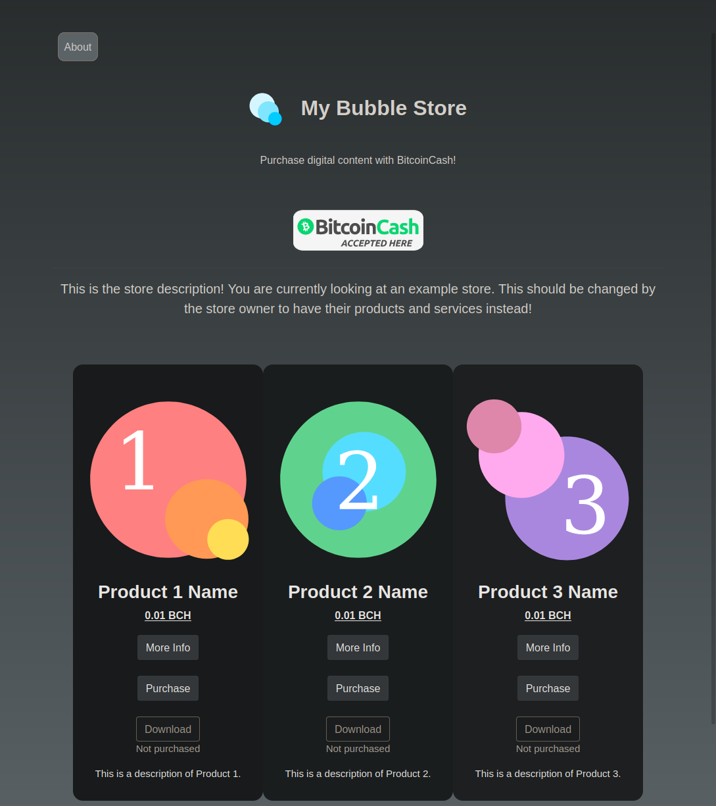
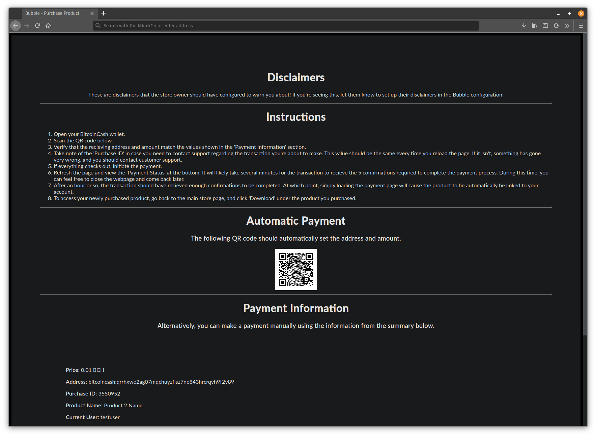

# Bubble

Version 1.1 

A simple BitcoinCash store written for PHP.

---

## Warning

While I've made every effort I can to ensure Bubble is stable and secure, I'm not perfect. V0LT is not responsible for any damages or losses incurred through any failures caused by Bubble. I designed Bubble to sell small fund raising products around $10. If your products are significantly more expensive than a few dollars, it is highly recommended you audit the code yourself before using Bubble in a production environment. 

## Description

Bubble is a self hosted digital content store designed around BitcoinCash. Bubble handles all of the store management and transactions for you so you can focus on producing your content. Bubble works great for all types of digital content, regardless of whether you create music, videos, books, programs, or all of them! With some modification, Bubble could also work for physical products, though it wasn't designed with this use in mind.

If you've been looking for a way to sell your digital media without violating the privacy of your users, Bubble might just be for you!

## Features

### Open Source

Bubble and all of it's dependencies are completely open source, allowing you to study and audit the code yourself.

### Self Hosted

Bubble doesn't require you use any third party services. Everything you need to automatically accept payments is hosted on your own server!

### Private

Bubble is designed to be as privacy respecting as possible for both users and you as an admin! There are no trackers or privacy invasive functionality built in.

### Modern

Bubble is designed in a clean and modern aesthetic.

### Mobile Friendly

Bubble is designed to be visually appealing on both large desktop screens, and small mobile devices.

### JavaScript Free

Bubble doesn't require JavaScript and is fully functional without it.

### Well Documented

All of the source code for Bubble is well documented and easy to understand.

### Lightweight

Bubble doesn't contain bulky raster images or other elements that could slow down web-page loading. Bubble loads quickly and efficiently without compromising on aesthetics.

### Convenient

Bubble is designed with convenience and easy of use in mind. Settings and configuration values are kept in centralized files where they can be cleanly laid out.

### Highly Configurable

Bubble's configuration system allows plenty of customization without ever modifying the source code of any pages. You can change the background colors of pages, the border radius of product tiles, and plenty more!

### Accessible

Out of the box, Bubble is easily accessible to those with visual impairments, and is fully accessibility compliant.

### Simple

With Bubble, you'll spend less time explaining to users how to make cryptocurrency payments, and more time working on your projects! Bubble describes in easy to understand terms how to purchase products, and your users are worked through the entire process step by step.

### Failsafe

Configuring payment processors and store applications can be stressful, knowing that one missed step can lead to catastrophic failure down the road. While you should still do everything you can to configure everything properly, Bubble is designed to fail safely. In other words, if something is misconfigured, Bubble was alert your user of the problem, prompt them to contact you, and halt the transaction before any damage can be done.

## User Experience

This is how your Bubble store would look to a user!

1. When your users open your Bubble store, they'll be greeted with a visually appealing, modern store-front listing all of your products in an organized, easy to understand layout.

2. After seeing a product that interests them, they may press the 'More Info' button, to be brought to a page describing the product in better detail.
3. If they decide to make a purchase, all they have to do is press the 'Purchase' button!
4. They'll be brought to a page where they will be prompted to scan a QR code with their BitcoinCash wallet. Simply scanning the QR code will cause all of the transaction information, including the address and price, to be automatically filled out. They simply press 'Send' in their wallet and the verification process begins!

5. At this point, the user can close the page and come back at any time. Once the transaction is approved, the product they purchased will appear in their account!

